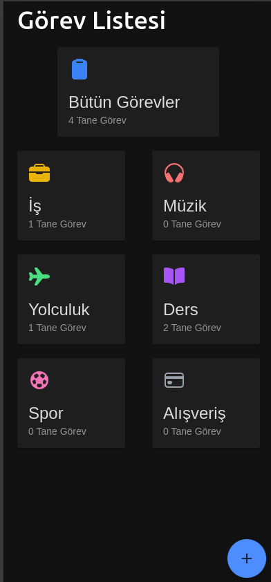

# Görev Planlayıcı Uygulaması

Bu proje, kullanıcıların günlük görevlerini kategori bazlı olarak yönetebileceği bir **görev planlayıcı** mobil uygulamasıdır. **Ionic Framework** kullanılarak geliştirilmiş olup, veriler **Firebase Database** üzerinde saklanmaktadır.

## 📌 Özellikler
- **Kategori Bazlı Yönetim**: Görevler **İş, Müzik, Yolculuk, Ders, Spor, Alışveriş** kategorilerine ayrılır.
  
- **Görev Ekleme**: Kullanıcılar **Başlık, Açıklama, Tarih ve Kategori** seçerek görev ekleyebilir.
- **Tarih Bazlı Filtreleme**:
    - **Gelen Yapılacaklar** (İleriki tarihli görevler)
    - **Bugün Yapılacaklar** (Bugünkü görevler)
    - **Yapılanlar** (Tamamlanmış görevler, üstü çizili gösterilir)
    - **Geçen Yapılacaklar** (Süresi geçmiş ama tamamlanmamış görevler)
- **Kaydırma Hareketleri**:
    - **Sağa Kaydır** → Silme işlemi
    - **Sola Kaydır** → Tamamlandı olarak işaretleme

## 🛠 Kullanılan Teknolojiler
- **Ionic Framework** (Mobil UI)
- **Firebase Database** (Gerçek zamanlı veri saklama)
- **TypeScript & Vue** (Frontend geliştirme)

## 📷 Ekran Görüntüsü

---
Bu proje, görev yönetimini kolaylaştıran kullanıcı dostu bir mobil uygulamadır. Katkılarınızı bekliyoruz! 🎯

